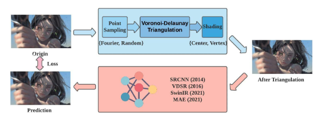

# 非均匀稀疏样本图像超分辨率重建：基于傅里叶变换撒点法与Voronoi-Delaunay三角化的高层视觉与低层视觉并用方法
```
Non-uniformly Sparsely Sampled Image Super-Resolution and Reconstruction: A Method Based on Fourier Transformation Point Sampling and Voronoi-Delaunay Triangulation from High Level Vision and Low Level Vision
```
迮炎杰，刘祺

# 项目说明
本项目为**CS337：计算机图形学**的课程大作业。课题为“非均匀稀疏样本图像超采样”。我们的算法框架主要致力于解决如下问题：将一张非均匀采样的图像尽可能复原为原图。
下面展示了使用我们的算法进行非均匀采样后的图像。这三张图分别为：原图，使用1000个采样点的图像，使用10000个采样点的图像。


# 系统框架
我们的算法框架支持多种采样方法，多种着色方法，多种SOTA的神经网络算法。下图展示了我们的算法的整体流程。


# 使用方法

1. 训练各类CG模型：`sh scripts/train_cg.sh`
2. 测试各类CG模型：`sh scripts/eval_cg.sh`

想要使用不同的模型（SRCNN，SRCNN2，SwinIR，VDSR，MAE）与不同参数请在对应script中修改。

