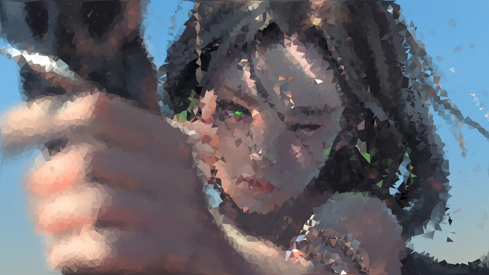

# Non-uniform Grid Deep Learning Super Sampling

这是我们的demo.


采样后结果，分别是采样1000个点和10000个点。




# To Do List
- [ ] 采样
  - [x] Center
  - [x] Vertex
  - [ ] linear interpolation
- [ ] 模型方法
  - [x] Super Resoultion CNN (SRCNN), for single img (ECCV 2014)
  - [x] Conditional Normalizing Flows (CNF), for single img (ICLR 2020)
  - [ ] multi-frame SRCNN (MSRCNN)，自己编的一个模型。实现思路，多张图片输入，先encode一下，然后再输入SRCNN。要改一下dataset的定义。
  - [ ] GAN/cycleGAN (目前加了模型，但是还没有想好怎么做，直接img-to-img translation 似乎没有必要)
  - [ ] 其他更fancy/SOTA的算法
- [ ] 提高框架的使用性
  - [ ] 更好的log方式
- [ ] 报告
  - [x] 报告框架
  - [ ] 相关工作


# 使用方法
首先下载数据集，在release里面。然后可以通过`--data_root`指定你放数据的地方。

然后训练模型：
```
python train.py --alg SRCNN
```
更多的参数设置请查看`arguments.py`。在`scripts/`目录下面有一些实例脚本，可以先尝试。


# 记录 & 进度
# 介绍
项目简介：目前超采样算法都是从图像到图像的输入和输出，图像可以看作一种致密的均匀网格（dense uniform grid）。在此，我们试图更改输入为更一般化的非均匀系数样本的网格，尝试基于深度学习的超采样图像重建。(右图只是示意，图中网格过于稀疏，实际难以保证质量。）

任务：可以使用Voronoi-Delaunay随机撒点三角化算法预先在图像上覆盖生成网格，逐顶点采样图像样本。参考图像超采样深度学习相关文献，设计类似输入为网格样本的超采样算法， 重建原始图像。


要求：设计相关神经网络算法，可控制调整网格密度和点分布，生成图像重建结果，比较质量；尝试尽可能降低网格密度并获得高质量还原图像；尝试减少神经网络深度（可附加其他预处理），提升性能。

# 方法

## 算法流水线
training:
```
Input: img_origin
1. Sample on img_origin and get img_sampled 
2. Input img_sampled into SuperResolution Network and get img_reconstructed.
3. Compute loss and backward.
```

testing：
```
Input: img_origin
1. Sample on img_origin and get img_sampled 
2. Input img_sampled into SuperResolution Network and get img_reconstructed.
```

## 数据集
Set14, [link](https://deepai.org/dataset/set14-super-resolution)

## 采样
原图：

首先使用Voronoi-Delaunay进行三角采样，获得如下图所示的结果：


## Backbone/Baseline
1.SRCNN, ECCV 2014, [link](https://github.com/yjn870/SRCNN-pytorch)
下面两幅图分别是SRCNN和SRCNN2在一个epoch后进行预测的结果。说明了只增加网络宽度和深度后，模型拟合会更慢，会导致算法效果变差。但是在很多个epoch后是否还会这样不清楚。


# 参考
1. Neural supersampling for real-time rendering, 2020, [link](https://research.fb.com/wp-content/uploads/2020/06/Neural-Supersampling-for-Real-time-Rendering.pdf)
2. A review, [link](https://cseweb.ucsd.edu/~ravir/tianchengsiga.pdf)
3. Learning Likelihoods with Conditional Normalizing Flows, 2019, [link](http://arxiv.org/abs/1912.00042)