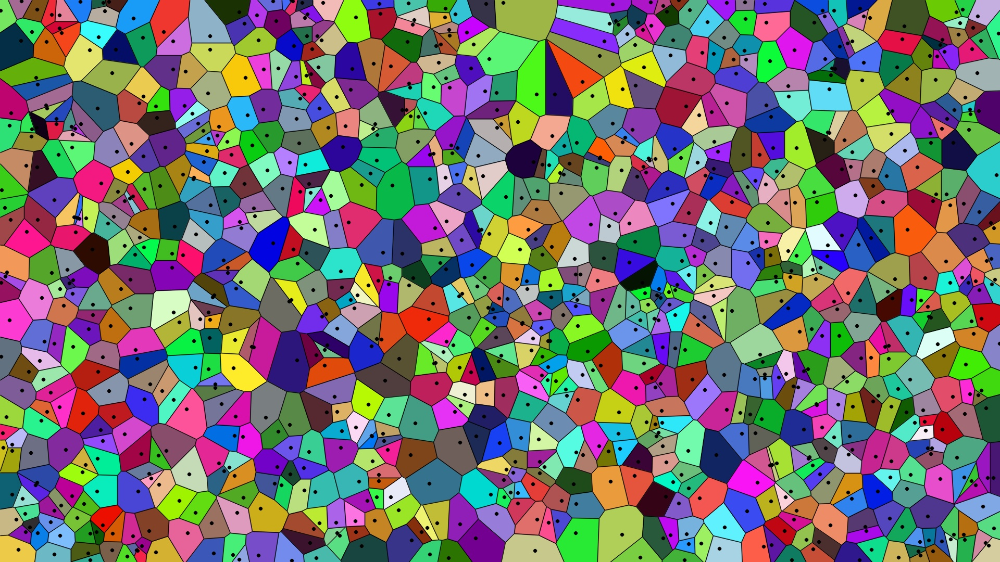

# Non-uniform Grid Deep Learning Super Sampling

Here's our demo.





# Usage
Sample.
```
python sample.py 
```

# Record & Progress
## Introduction
项目简介：目前超采样算法都是从图像到图像的输入和输出，图像可以看作一种致密的均匀网格（dense uniform grid）。在此，我们试图更改输入为更一般化的非均匀系数样本的网格，尝试基于深度学习的超采样图像重建。(右图只是示意，图中网格过于稀疏，实际难以保证质量。）

任务：可以使用Voronoi-Delaunay随机撒点三角化算法预先在图像上覆盖生成网格，逐顶点采样图像样本。参考图像超采样深度学习相关文献，设计类似输入为网格样本的超采样算法， 重建原始图像。


要求：设计相关神经网络算法，可控制调整网格密度和点分布，生成图像重建结果，比较质量；尝试尽可能降低网格密度并获得高质量还原图像；尝试减少神经网络深度（可附加其他预处理），提升性能。

## Method

### Overall Pipeline
training:
```
Input: img_origin
1. Sample on img_origin and get img_sampled 
2. Input img_sampled into SuperResolution Network and get img_reconstructed.
3. Compute loss and backward.
```

testing：
```
Input: img_origin
1. Sample on img_origin and get img_sampled 
2. Input img_sampled into SuperResolution Network and get img_reconstructed.
```

### Sampling

## Reference
1. Neural supersampling for real-time rendering, 2020